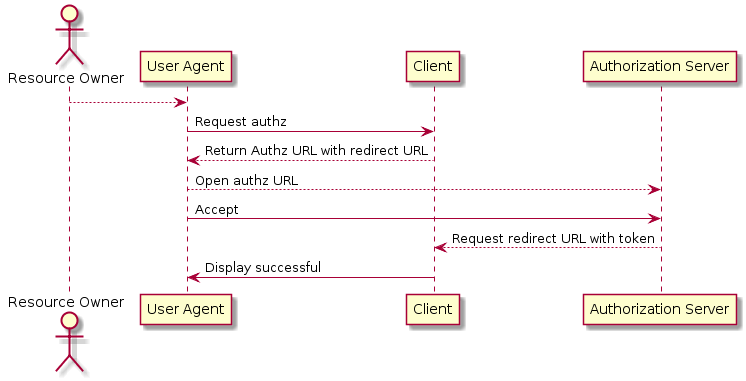

Echo Authorization Flow
===

Overview
---
- OAuth2 Implicit Flow の出来損ないのみ
- 将来的には OAuth2 に対応したい

About "OAuth2 Implicit Flow の出来損ない"
---

```uml
actor "Resource Owner"

"Resource Owner"-->"User Agent"
"User Agent"->"Client" : Request authz
"Client"-->"User Agent" : Return Authz URL with redirect URL
"User Agent"-->"Authorization Server": Open authz URL
"User Agent"->"Authorization Server": Accept
"Authorization Server"-->"Client" : Request redirect URL with token
"Client"->"User Agent" : Display successful

```

[]()
